## Task 1
> FishEye analysts want to better **visualize changes in corporate structures over time**. Create a visual analytics approach that analysts can use to **highlight temporal patterns and changes in corporate structures**. *Examine the most active people and businesses* using visual analytics.

To examine the most active companies we first search for interesting candidates in the "Company Overview" tab. 
A high-number of in-relations most-likely corresponds to highly active companies and inspecting the plot "Beneficial Ownerships" vs. number of "In-Relation"'s we find two outliers. 

"Downs Group" and "Mills, Atkinson and Chavez" both exhibit low revenue, few shareholders, and workers, but have a high in-degree and beneficial ownerships. We find that their local neighbourhoods in the graph view still look normal.

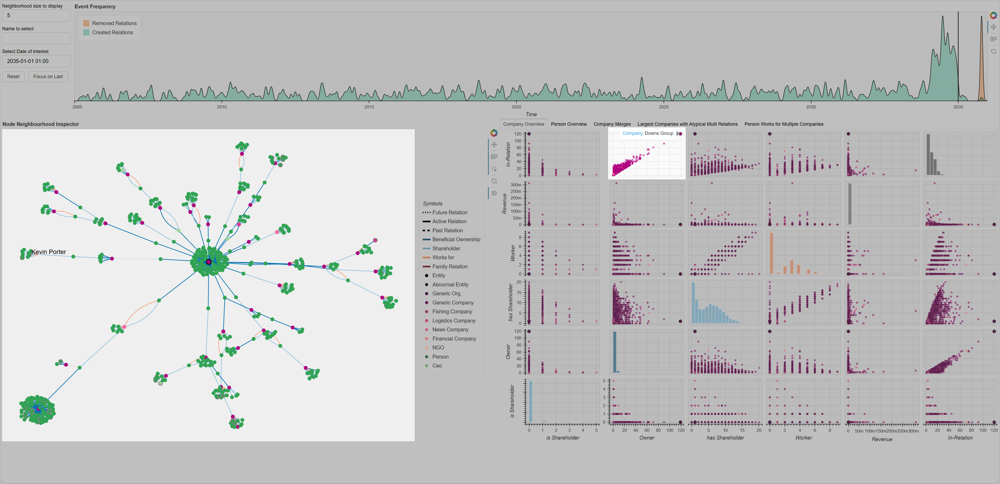
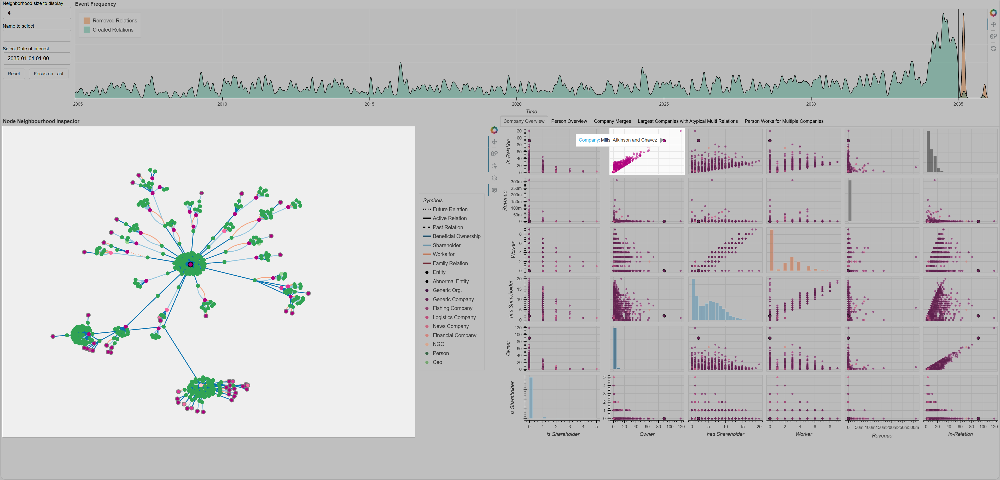

Different anomalies appear in the "Worker" vs. "has Shareholder" scatterplot, where some companies have no workers but many shareholders. In the graph view, St'astna Strnad v.o.s. neighbours another company with which it will share many future shareholders.

 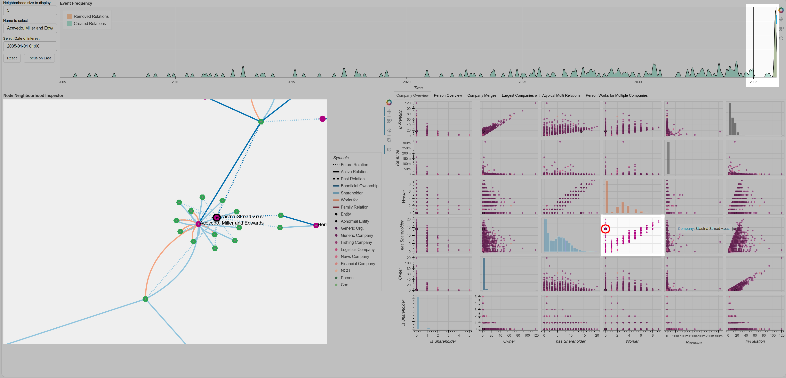

Focusing on the kde-plot, we notice a peak of both created and deleted edges. Zooming in and selecting a time point after this peak, we see that all shareholders have switched the company. Since this happens after Southseafood ExpressCorp’s changes, we hypothesize that the shareholders switch to a new company to hide previous illegal fishing behavior.

 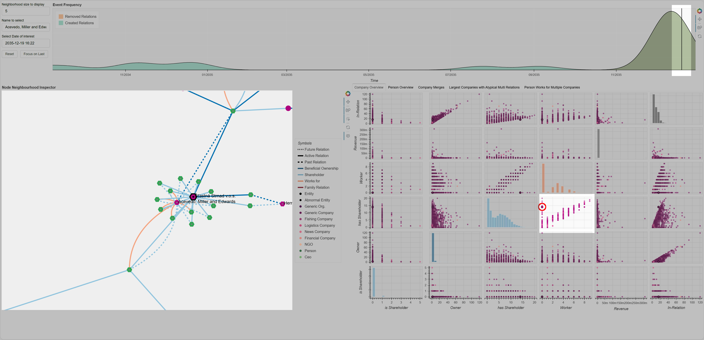

Lastly, in the "Person Overview" SPLOM, we inspect people with a high number of "Out-Relation." Jennifer Gardner and Anne Villanueva have many beneficial ownerships. However, benefiting from many related companies may still be normal.

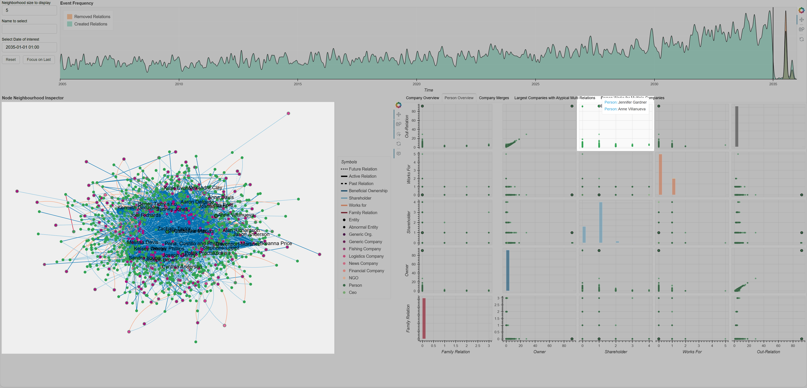
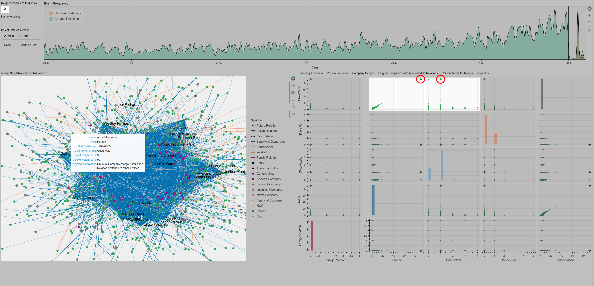

## task 2
> Using your visualizations, find and display **examples of typical and atypical business transactions** (e.g., mergers, acquisitions, etc.). Can you *infer the motivations behind changes* in their activity?
> 

To find typical business transactions, we inspect the lower part of the "Company Merges" tab showing a heatmap over time of people with a large number of beneficial ownerships. We observe that Tyrone Fuller acquires 3 ownerships in 2019. 
Inspecting his neighbourhood, we find that he is connected to somewhat normal looking companies and since some persons are may be more inclined to own more companies than others, we think that this does not show illegal behaviour.
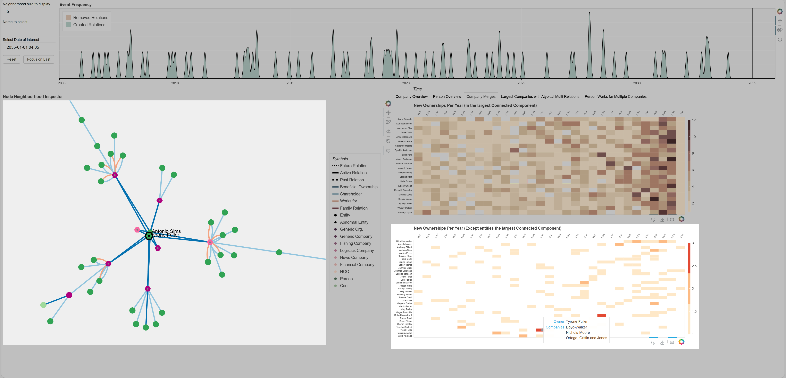

For atypical transactions, we look at persons with atypical multi-relations, as these are infrequent and potentially problematic. Each glyph in this plot represents the relative timing of these multi-relationships, with the x-axis indicating the number of in-relations the corresponding company has.

Tim Hays, for example, is the only shareholder of Flores Grant, which besides that has only beneficial ownership relations. Using the kde plot, we observe that a few months after the SouthSeafood changes, Tim Hays becomes the sole worker of Flores Grant. This worker relationship might be an attempt to hide prior illegal behavior without any official workers. 
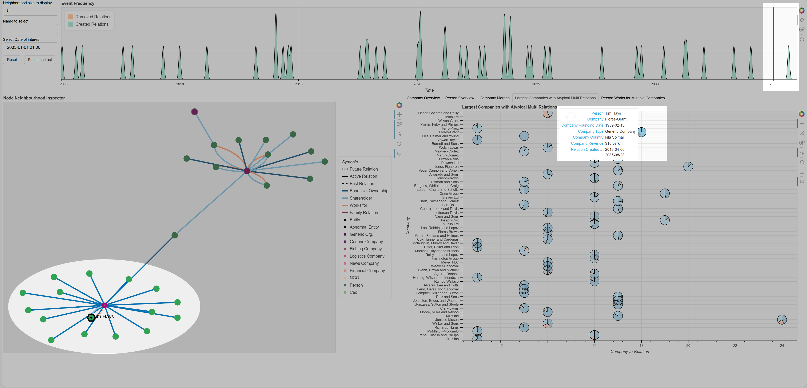

Using the kde plot, we observe that only a few months after the changes around SouthSeafood occur, Tim Hays becomes the sole worker of Flores Grant. Therefore, this worker relationship might be an attempt to hide prior illegal behavior without any official workers.

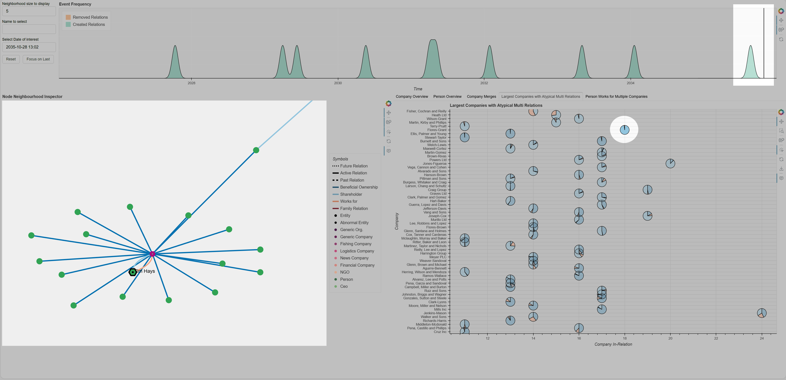

We provide a variation of a slope graph to identify potential conflicts of interest or other unusual business activities. 
Each polygonal chain corresponds to a person and glyphs correspond to time events when a person starts working for a company.

Sanaa El-Amin is easily identified as the person working for the most companies and is a member of the network containing SouthSeafood. Since she works for Stichting-Marine Company, which is clearly related to SouthSeafood, the other companies she works for are likely also involved in illegal activities.
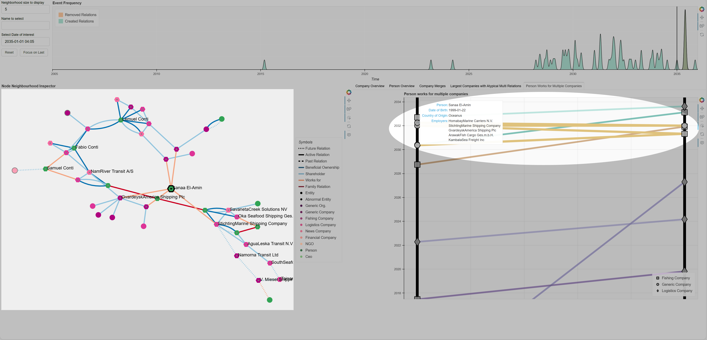
To illustrate the influence of a company's network over time, we provide a heatmap of people with the most company acquisitions and observe that the number of acquisitions increases over time. 

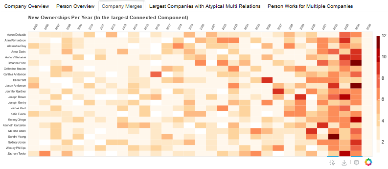
By clicking on a cell in the heatmap, we can examine the person in the graph view.
Since, we label all nodes in the graphlayout that occur in one of our tab-views, we discover that all these companies eventually converge to a single network.
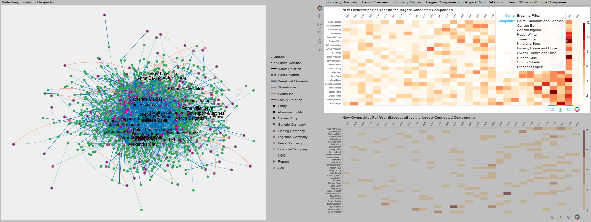
Hovering over the last suspicious-looking column, we see that they all acquired the same company in the last year, namely Polàk Procházka.
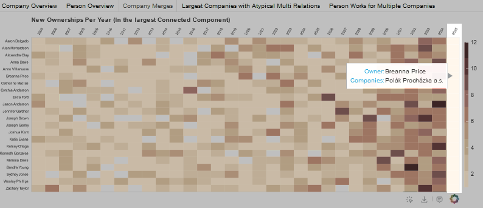
To examine this company more closely, we reduce the neighbourhood size to 2 and select only the suspicious company in the graph view.
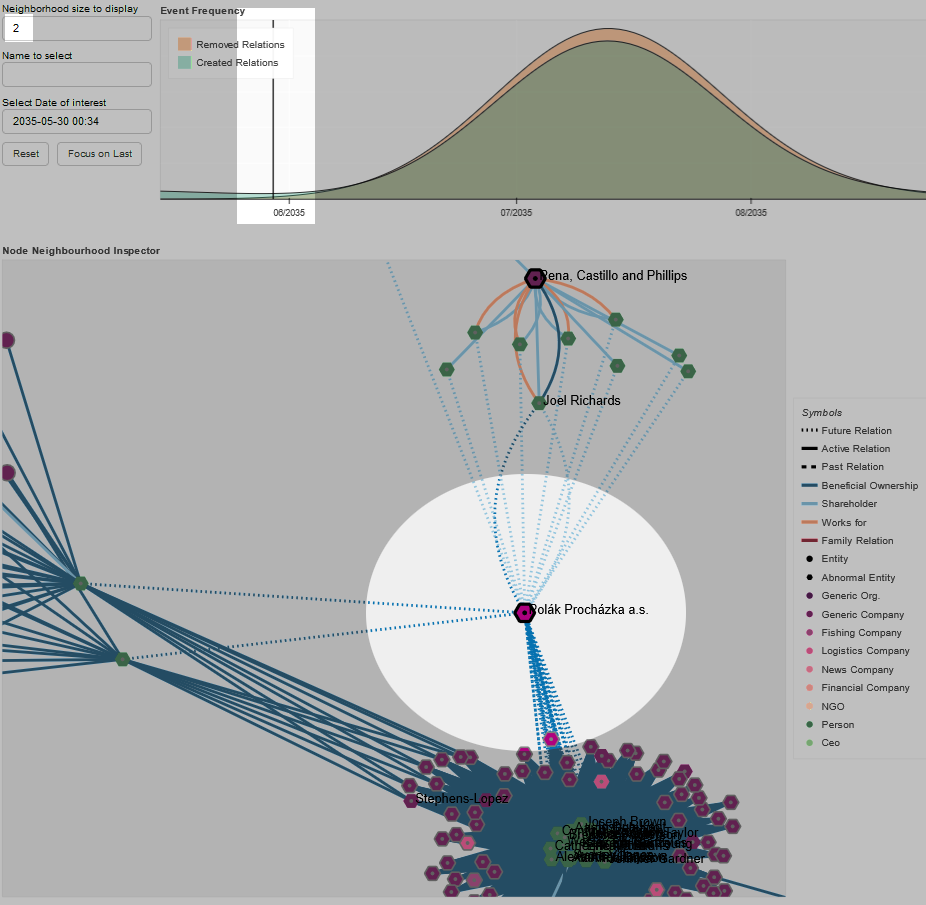
With the help of the kde plot, we can identify that many relationships are created and deleted in the same time period, which indicates a change. We can recognize futue relations in the graph by their dotted edges. This shows that Polàk Procházka does not have a single edge before the peak.
If we take a look at the time after the change, we can see that all owners separate from two companies, recognizable by the dotted lines.
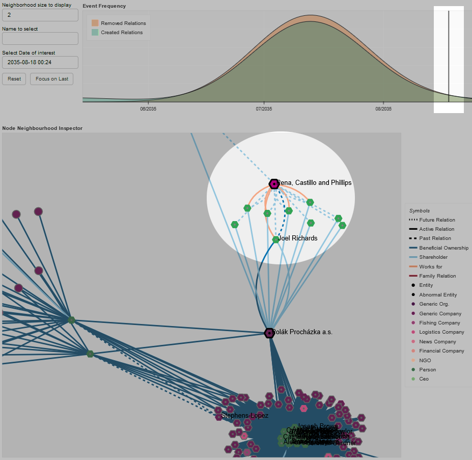
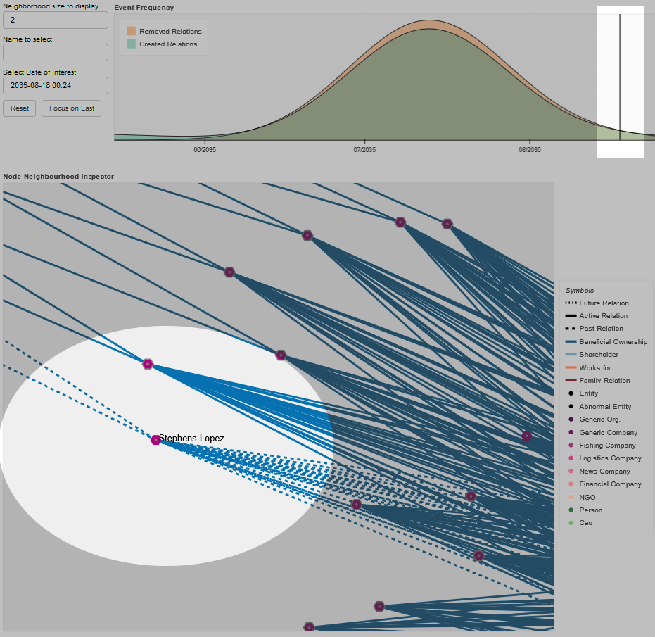
 All these changes happen one month after the SouthSeafood incident.

## Task 4
> Identify the *network associated with SouthSeafood Express Corp* and **visualize how this network and competing businesses change as a result of their illegal fishing behavior**. Which *companies benefited from SouthSeafood Express Corp legal troubles*? Are there *other suspicious transactions that may be related to illegal fishing*? Provide visual evidence for your conclusions.
> 
To inspect SouthSeafood Express Corp, we can directly search its name or return to the start (via reset), where SouthSeafood Express Corp is automatically selected.
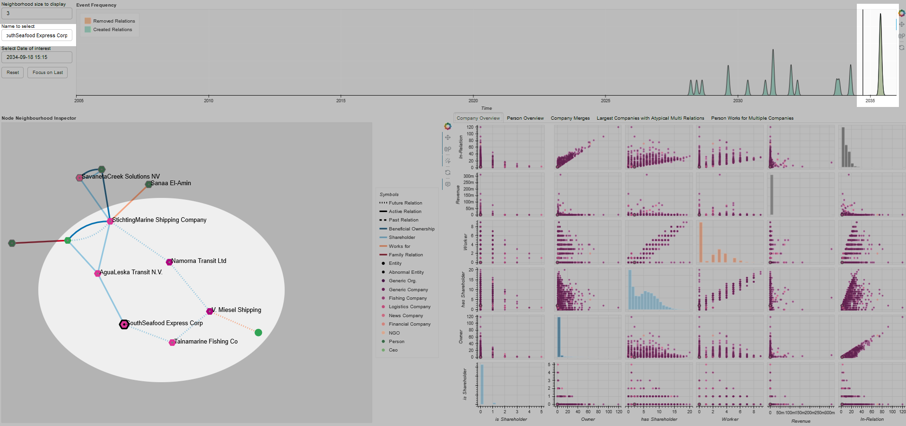
Based on the kde representation, we can again see that many relationships are created and deleted in the same period, which again indicates a switch. We can see that several edges will be added in the direct surroundings of SouthSeafood.
To analyze the entire network in which SouthSeafood is located, we increase the neighbourhood size to 9.
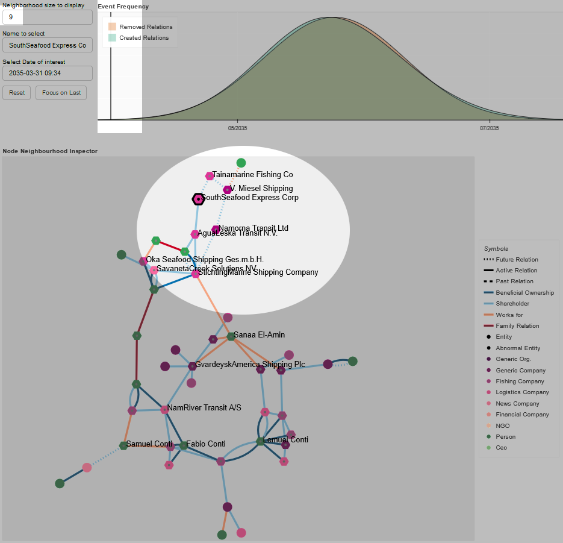
If we take a look at the time after the switch, we can see how the connection from SouthSeafood to StichingMarine Shipping Company is replaced by new edges and shell companies, while the direct path is deleted. 
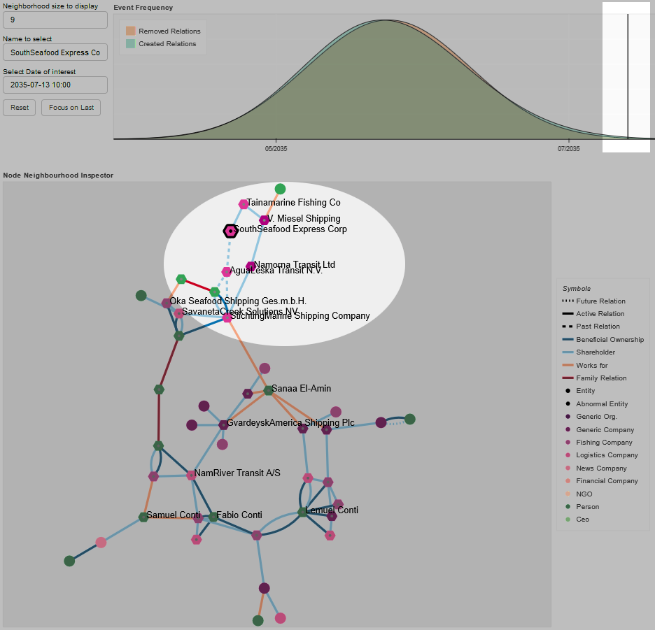
This leads to the conclusion that they are trying to hide their relationship to SouthSeafood. We can date this change to May 2035 using the kde plot.

However, there are even more anomalies in this network
- many cycles, some of them with family relationships, recognizable by the red edges 
- people who benefit from several companies that have no or only a few workers, such as Lemuel Conti
- people who work for several companies, such as Sanaa El-Amin, shown in task 2
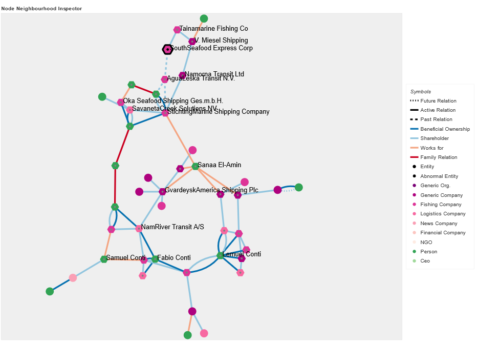

Consequently, this entire network appears suspicious.
