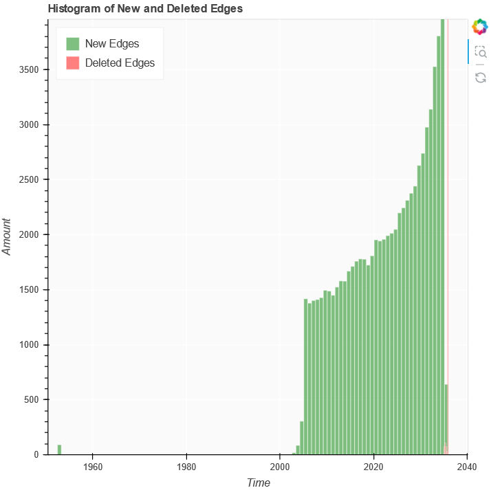
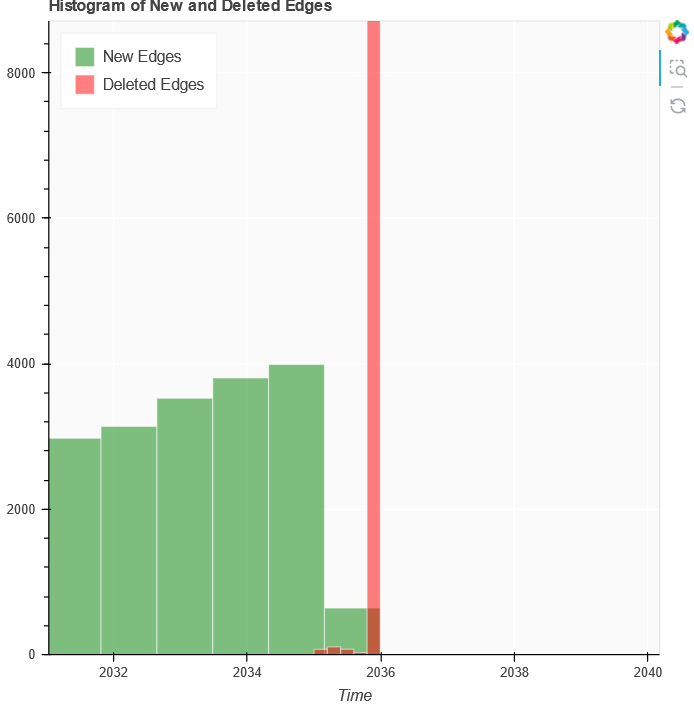
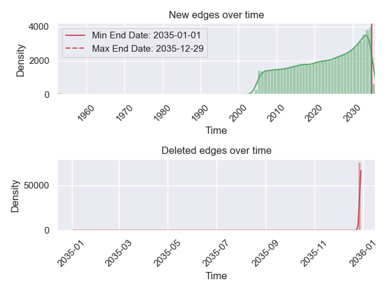
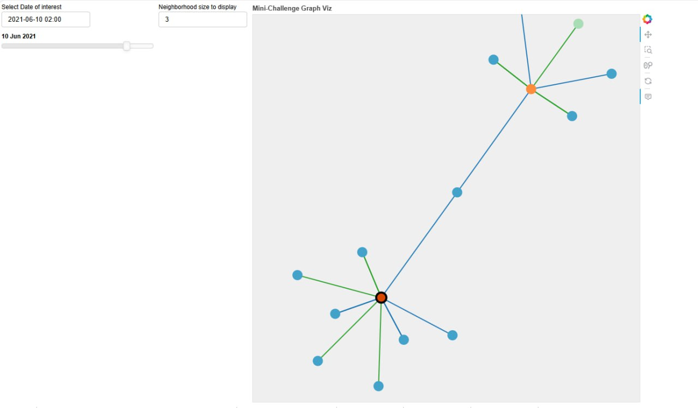
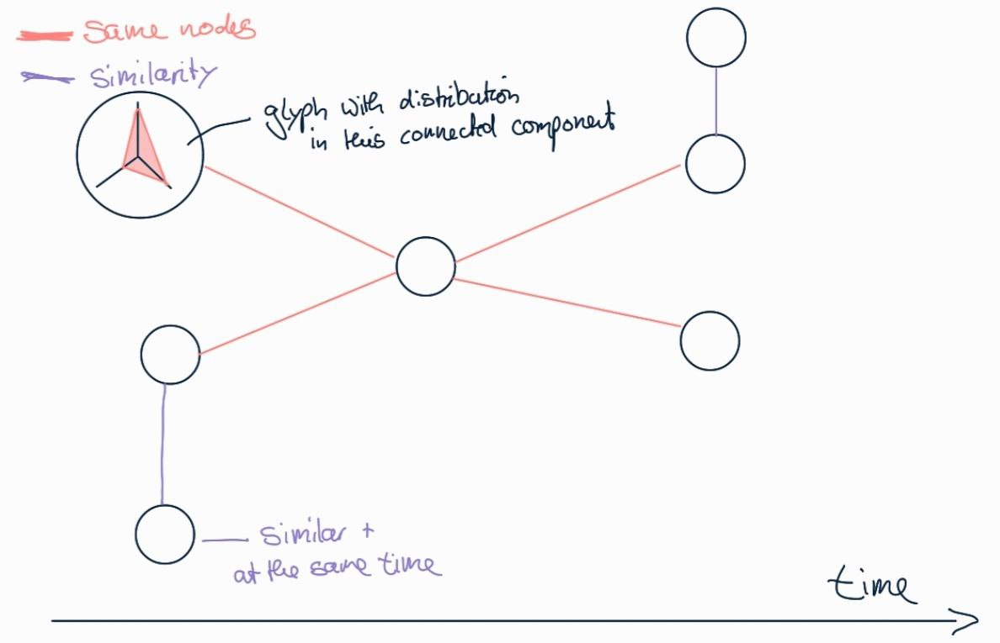

# Ideen_05-06-24
## Task 1

> FishEye analysts want to better **visualize changes in corporate structures over time**. Create a visual analytics approach that analysts can use to **highlight temporal patterns and changes in corporate structures**. *Examine the most active people and businesses* using visual analytics.

- active = meisten Verbindungen?
- active nodes / interessante nodes = eccentricity

### for all nodes & all edges

- [ ] split deleted edges by edge type
- [ ] tophat kernel with topological simplification
> not so informative do display all deleted and new at once (scaling)
> 

### for chosen nodes (bfs tree)
- chosen nodes at chosen time with their neighborhood
- 
> Placement of the nodes (no overlap but min screen splace)

### for connected component over time

> time from left to right possible?
