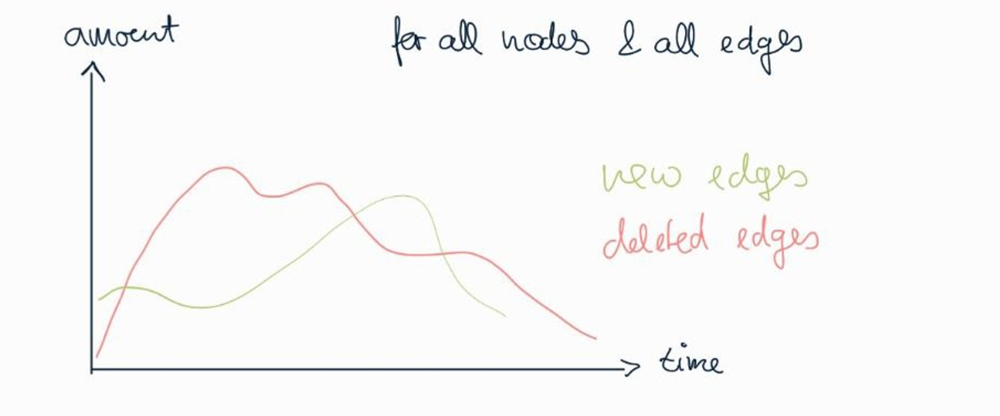
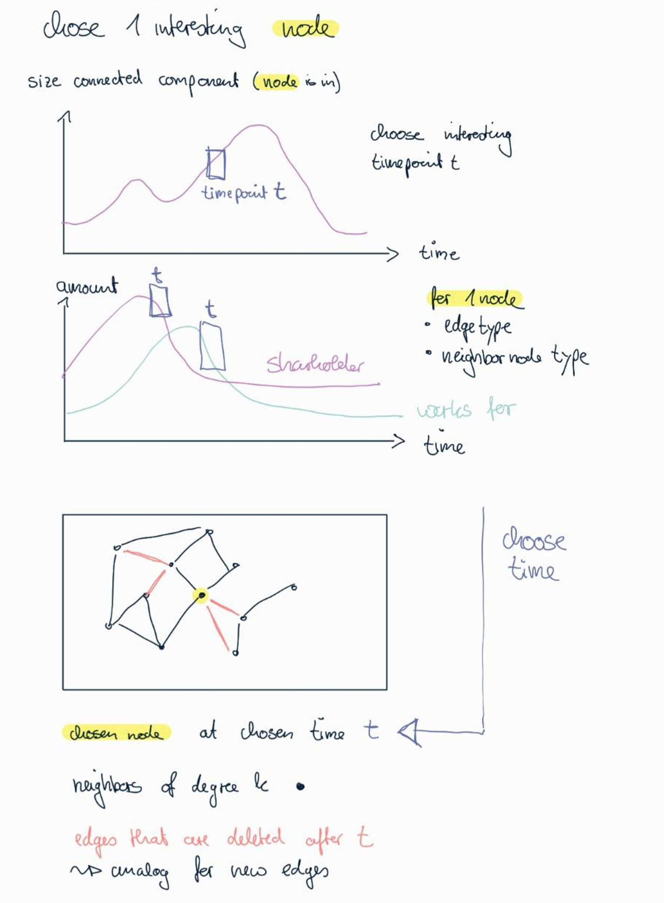
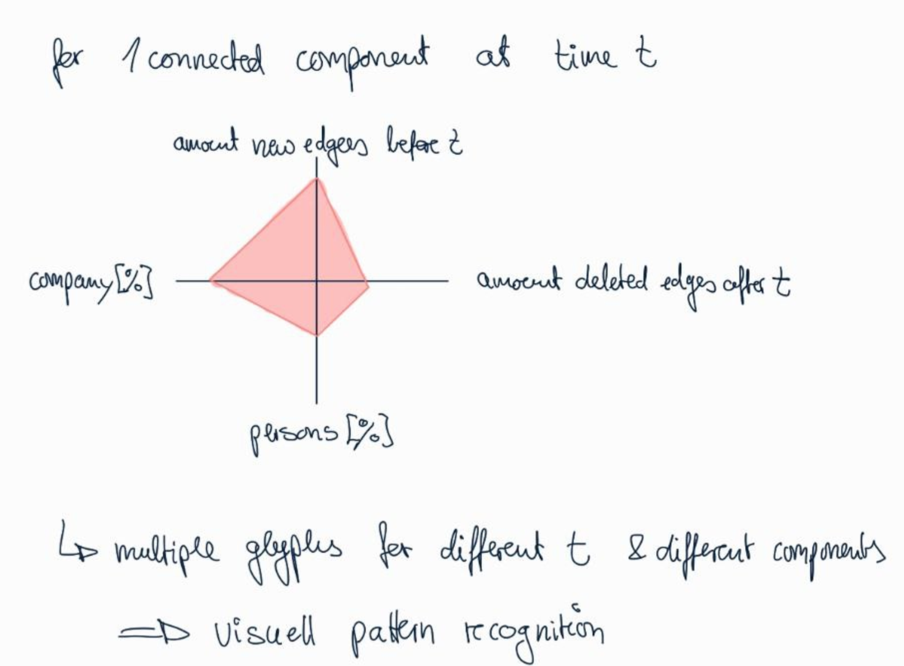
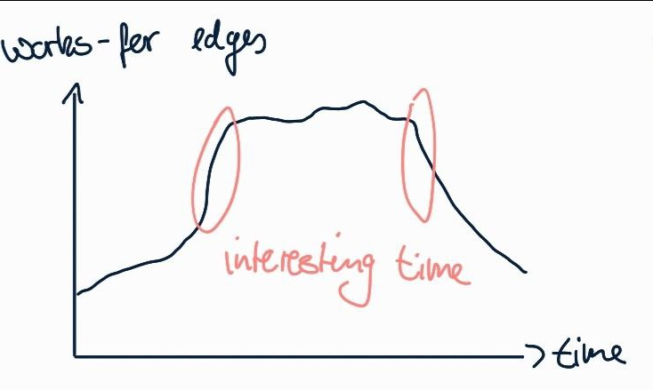
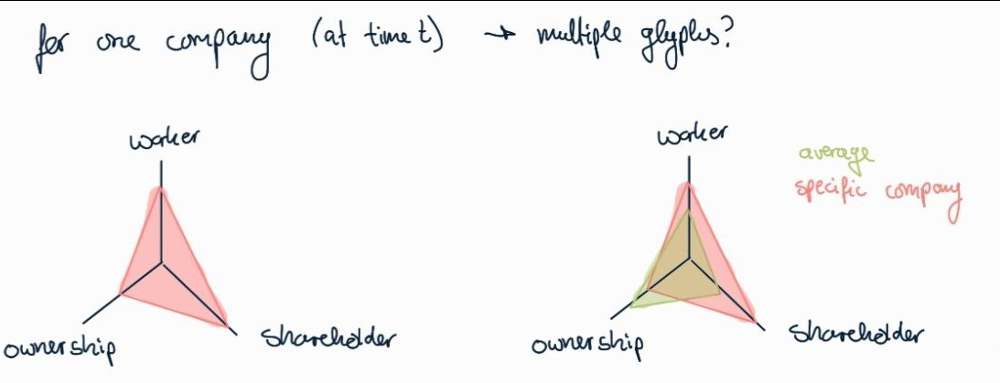
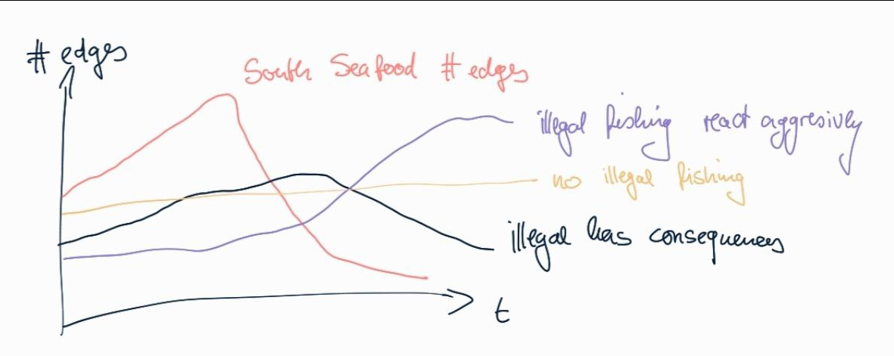

# Ideen_21-05-24

## Task 1

> FishEye analysts want to better **visualize changes in corporate structures over time**. Create a visual analytics approach that analysts can use to **highlight temporal patterns and changes in corporate structures**. *Examine the most active people and businesses* using visual analytics.
> 
- active = meisten Verbindungen?
- active nodes / interessante nodes = eccentricity

### for all nodes & all edges

### for one node

- input: Knotentyp → top 10 most / least eccentric
- for one chosen node:
    
    
    

### for chosen connected component (or multiple)

## Task 2

> Using your visualizations, find and display **examples of typical and atypical business transactions** (e.g., mergers, acquisitions, etc.). Can you *infer the motivations behind changes* in their activity?
> 

### aquisations

- new *works_for* edges of one company
    
    
    

### relation between worker, shareholder & ownerships

- for one company

- relation in a line plot over time
    - total amount
    - Änderungsrate

### Corruption

- find cycles that contain a family relation
- depending on size of company (Familienunternehmen = klein)

### Statistics → whats normal?

- average amount of workers per company

## Task 3

> Develop a **visual approach to examine inferences**. Infer how the influence of a company changes through time. *Can you infer ownership or influence that a network may have?*
> 
- influence =
    - number of edges
    - connected component size
- look at community in cluster
    - size of community
    - amount worker — amount owner (lot of worker & 1 owner = high influence & power)
    - compare companies with networks within companies

## Task 4

> Identify the *network associated with SouthSeafood Express Corp* and **visualize how this network and competing businesses change as a result of their illegal fishing behavior**. Which *companies benefited from SouthSeafood Express Corp legal troubles*? Are there *other suspicious transactions that may be related to illegal fishing*? Provide visual evidence for your conclusions.
> 

