## Task 1
> FishEye analysts want to better **visualize changes in corporate structures over time**. Create a visual analytics approach that analysts can use to **highlight temporal patterns and changes in corporate structures**. *Examine the most active people and businesses* using visual analytics.

To examine the most active companies we first search for interesting candidates in the "Company Overview" tab. 
A high-number of in-relations most-likely corresponds to highly active companies and inspecting the plot 
"Beneficial Ownerships" vs. number of "In-Relation"'s we find two outliers. 

"Downs Group" and "Mills, Atkinson and Chavez" both exhibit low revenue, few shareholders, and workers, but have a 
high in-degree and beneficial ownerships. We find that their local neighbourhoods in the graph view still look normal.

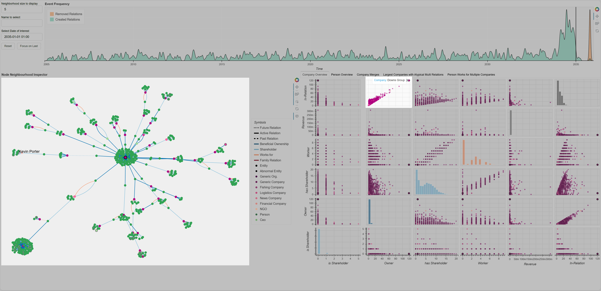
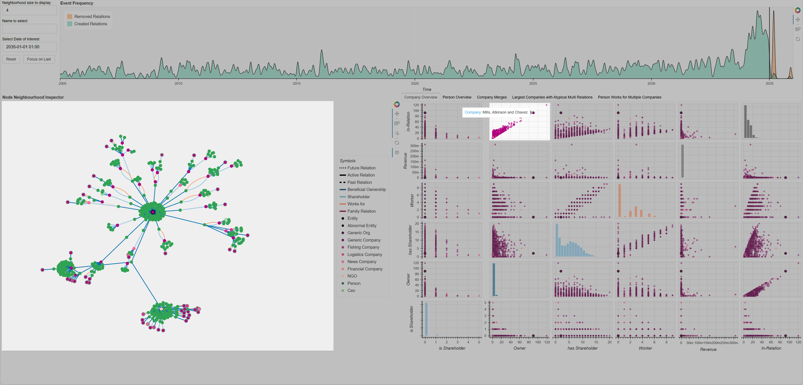

Different anomalies appear in the "Worker" vs. "has Shareholder" scatterplot, where some companies have no workers but 
many shareholders. In the graph view, we see that  the outlier company St'astna Strnad v.o.s. 
neighbors another company with which it will share many future shareholders.

 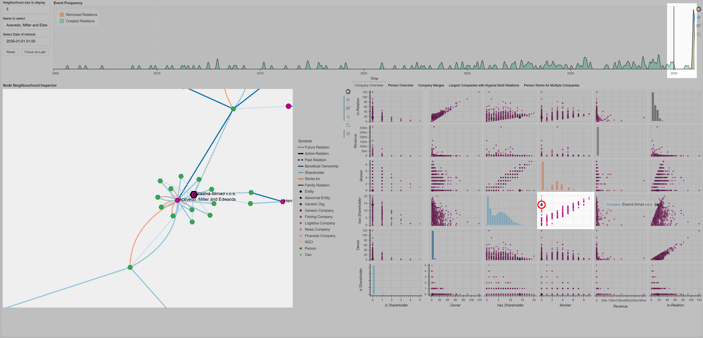

Focusing on the kde-plot, we notice a peak of both created and deleted edges. Zooming in and selecting a time 
point after this peak, we see that all shareholders have switched the company. Since this happens 
after Southseafood ExpressCorp’s changes, we hypothesize that the shareholders switch to a new company to hide previous 
illegal fishing behavior.

 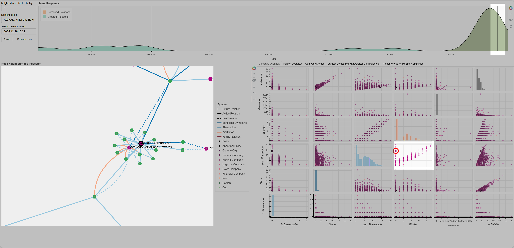

Lastly, in the "Person Overview" SPLOM, we inspect people with a high number of "Out-Relation." Jennifer Gardner and 
Anne Villanueva have many beneficial ownerships. However, benefiting from many related companies may still be normal.

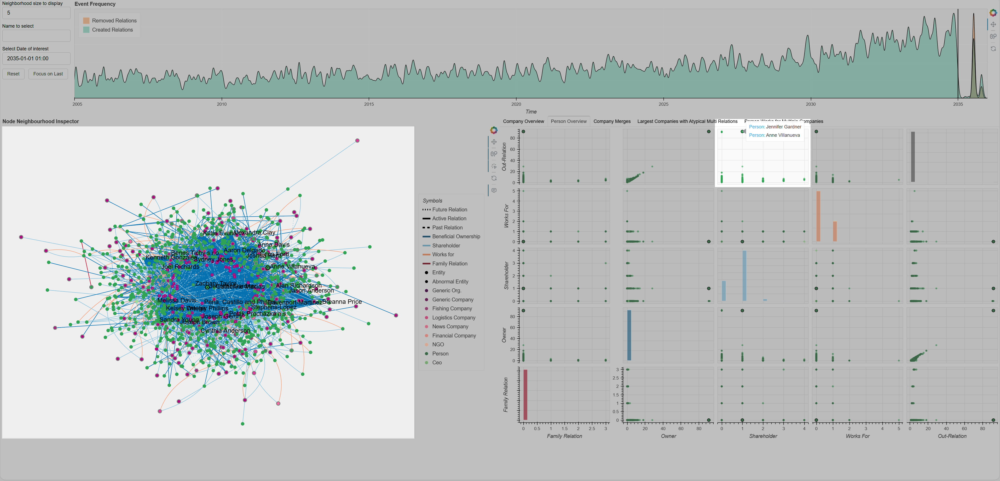
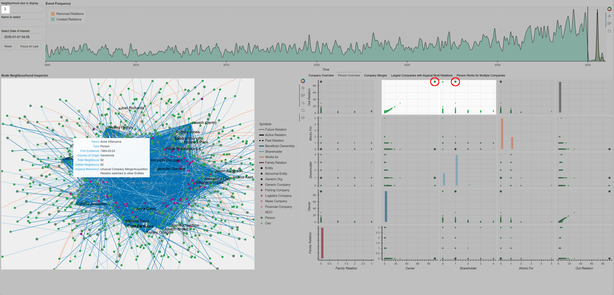

## task 2
> Using your visualizations, find and display **examples of typical and atypical business transactions** (e.g., mergers, acquisitions, etc.). Can you *infer the motivations behind changes* in their activity?
> 

To find typical business transactions, we inspect the lower part of the "Company Merges" tab showing a heatmap over time 
of people with a large number of beneficial ownerships. We observe that Tyrone Fuller acquires 3 ownerships in 2019. 
Inspecting his neighbourhood, we find that he is connected to somewhat normal looking companies and since some persons 
are may be more inclined to own more companies than others, we think that this does not show illegal behaviour.
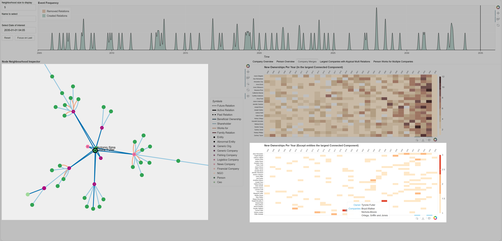

For atypical transactions, we look at persons with atypical multi-relations, as these are infrequent and potentially 
problematic. Each glyph in this plot represents the relative timing of these multi-relationships, with the x-axis 
indicating the number of in-relations the corresponding company has.

Tim Hays, for example, is the only shareholder of Flores Grant, which besides that has only beneficial ownership 
relations. Using the kde plot, we observe that a few months after the SouthSeafood changes, Tim Hays becomes the sole 
worker of Flores Grant. This worker relationship might be an attempt to hide prior illegal behavior without any 
official workers. 
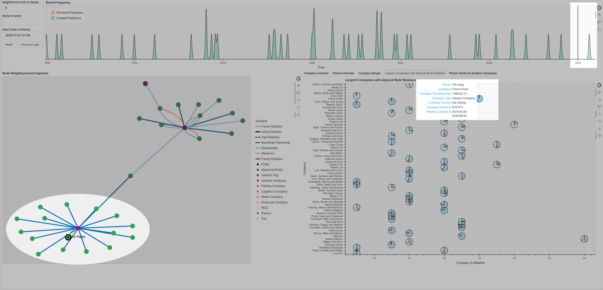

Using the kde plot, we observe that only a few months after the changes around SouthSeafood occur, Tim Hays becomes the 
sole worker of Flores Grant. Therefore, this worker relationship might be an attempt to hide prior illegal behavior 
without any official workers.

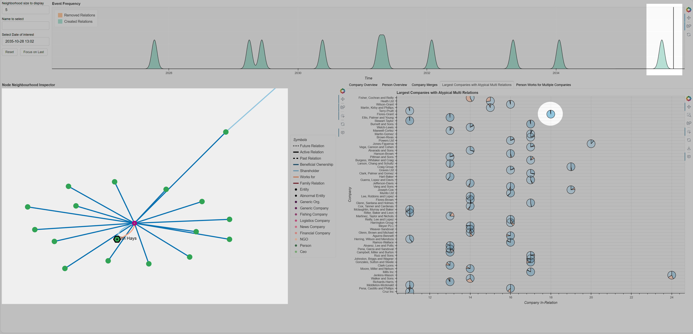

We provide a variation of a slope graph to identify potential conflicts of interest or other unusual business activities. 
Each polygonal chain corresponds to a person and glyphs correspond to time events when a person starts working for 
a company.

Sanaa El-Amin is easily identified as the person working for the most companies and is a member of the network 
containing SouthSeafood. Since she works for Stichting-Marine Company, which is clearly related to SouthSeafood, the 
other companies she works for are likely also involved in illegal activities.
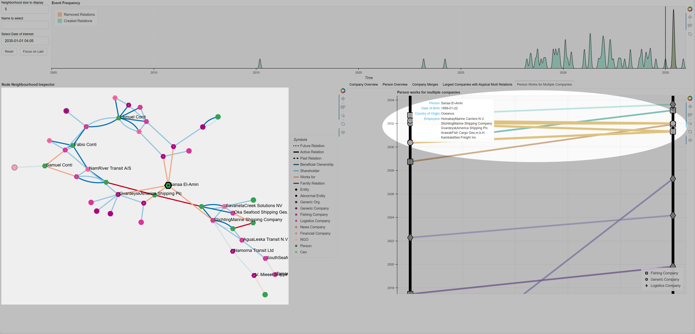

## Task 3
> Develop a **visual approach to examine inferences**. Infer how the influence of a company changes through time. *Can you infer ownership or influence that a network may have?*
> 
über Scatterplot, bewegen der Zeitachse sehen wie sich Einfluss ändert
Influence: Downs Group (hat kein Einkommen, entsteht erst 2034) nur noch die -> kde plot sehen wann was passiert
- Search for influence in company merges by clicking on Brenna Price since it shows that the influence of this network increases over time with more and more acquisitions
    - heatmap = look there
    - We find as expected the very large connected component
    - large component with hover from heatmap 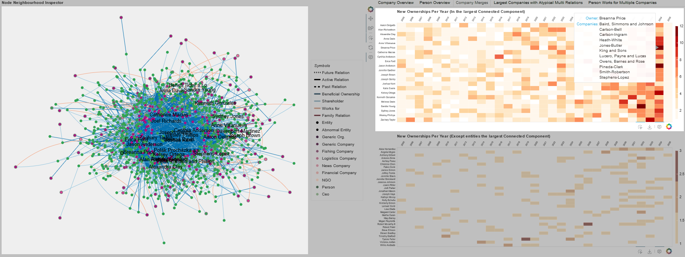
    - Scrolling over the last line, shows that Polak Prochazka is always added in 2035 => select in graph as it is marked with a label
    - hover last line 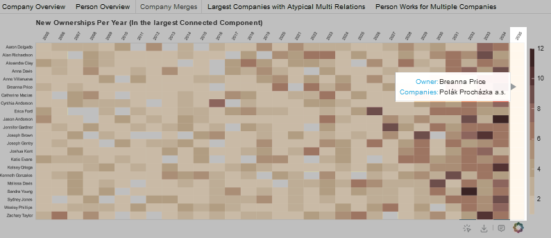
    - After Focus on Last there is very clear view with neighborhood size 2
    - 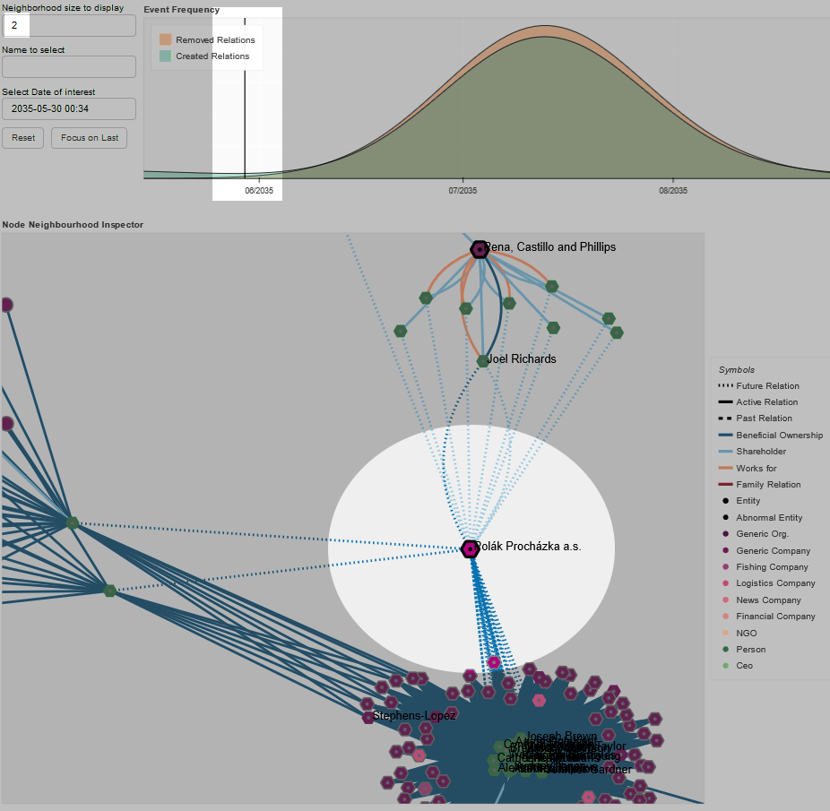
      - 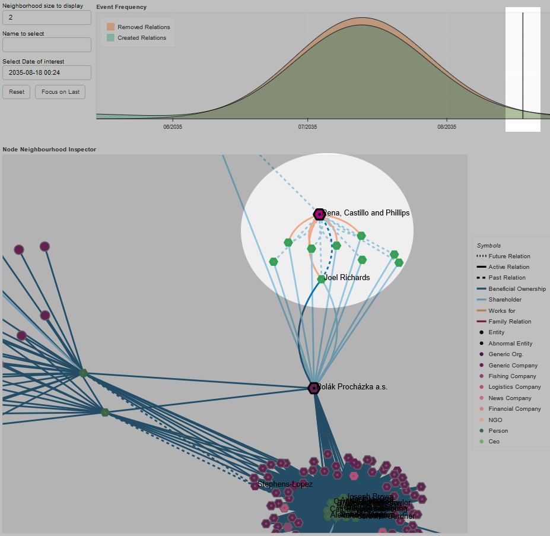
      - 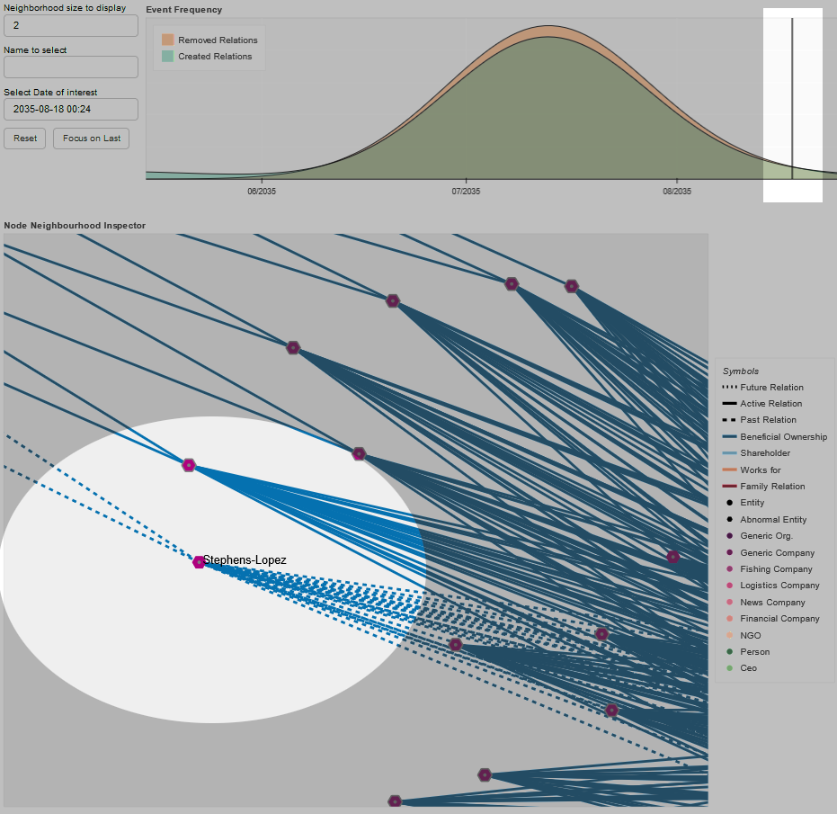
    - Clicking in kde before or after the peak shows a change with the Stephens-Lopez+ Pena, Castillo and Phillips company (labeled due to this change) 
    - Polak Prochazaka is only founded in 2035 and immediatly used as a new major company => merge shows people switching to another illegal company after Southseafood has been discovered
## Task 4
> Identify the *network associated with SouthSeafood Express Corp* and **visualize how this network and competing businesses change as a result of their illegal fishing behavior**. Which *companies benefited from SouthSeafood Express Corp legal troubles*? Are there *other suspicious transactions that may be related to illegal fishing*? Provide visual evidence for your conclusions.
> 
- South Seafood is pre-2035 connected via a single intermediate company (AguaLeska) to the main part of the connected compnent
   - In the kde plot we can see that there is a peak of creations and deletions at roughly the same time and in the graph plot we see that several new edges will be created
   - Switching after this peak, we see clearly how the edge between Southseafood and AguaLeska is removed whereas a less direct way is chosen to the main component
   - We hypotheize that Southseafood is trying to hide their continued illegal behavior behind the other newly created phantom companies (for which the hover tooltip shows when they are created)
   - task_04_southseafood_01.png and task_04_southseafood_01a.png
direkt oben eintippen, neighbor erhöhen, weiter expandieren
"da sind auch verdächtige Personen die wir vorher gefilter haben tauchen dort auf"
"Family Relations sind selten"
"viel viele Zyklen -> etwas verschleiern, Briefkastenfirmen?"
- "There are multiple anomalies in this network: many cycles, some with family relations, people benefitting from multiple companies with little or no workers, people working for multiple companies and the company switch associated with SouthSeafood. Therefore this whole network seems suspicious."
- "Additionally time is encoded via different edge markers: solid lines for active edges, dotted lines for future edges, and dashed lines for past edges. You can see how the connection from SouthSeafood to Stiching-Marine is replaced by new edges and shell companies, while the direct path is deleted. We date this switch in the kde plot to may 2035."

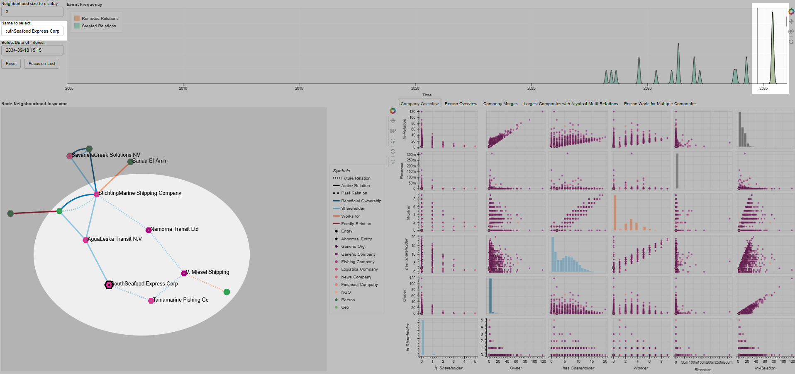
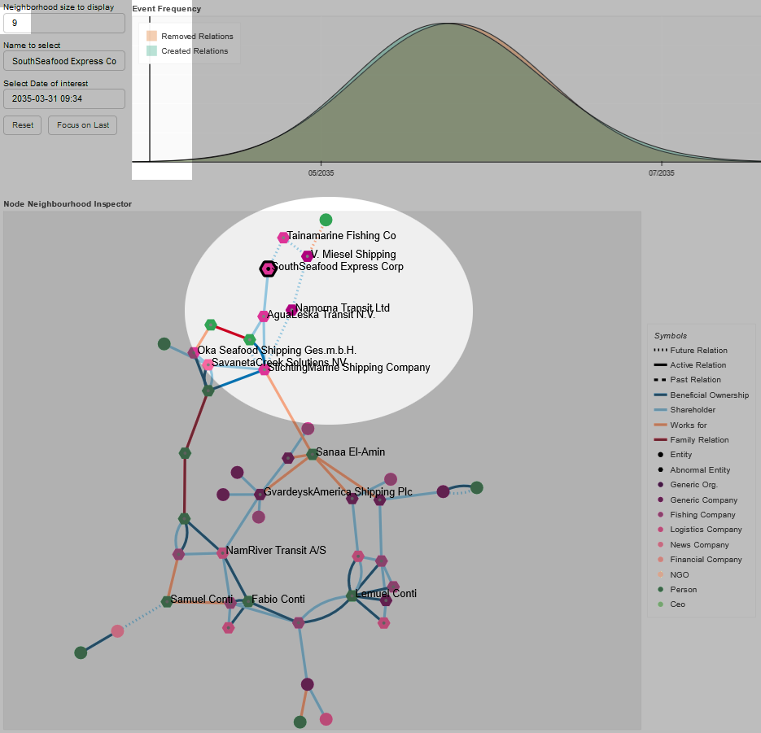
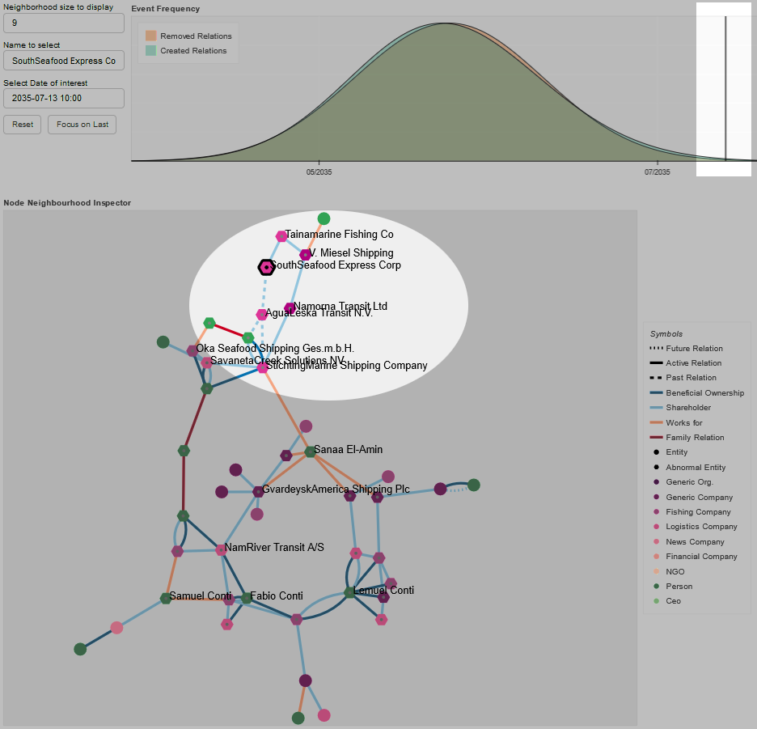
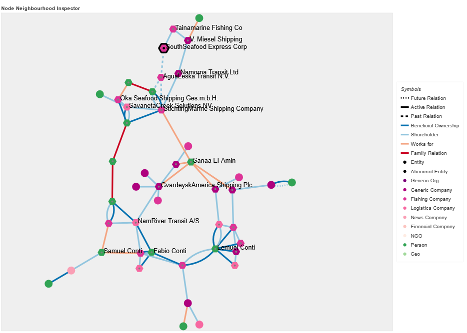

